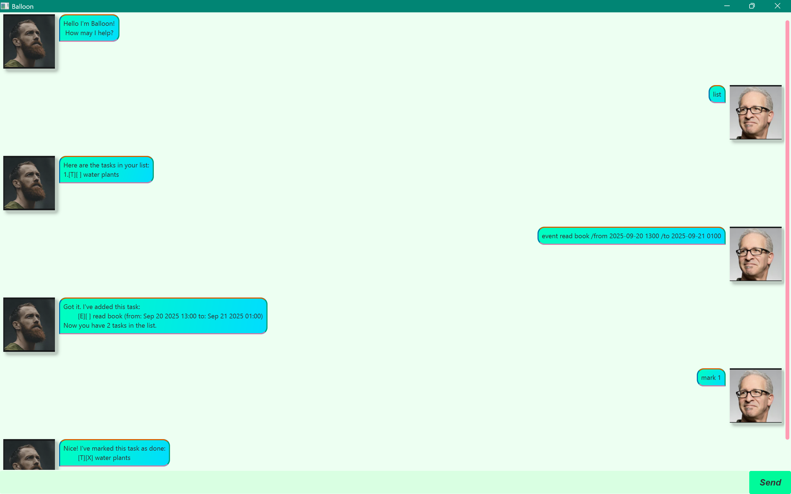

# Balloon User Guide



**Balloon** is a chatbot for you to **manage your tasks**, optimised for
those familiar with a Command Line Interface(CLI). \
There are 3 types of tasks supported: Todo, Deadline, and Event.

## Quick Start
1. Ensure you have Java 17 installed.
2. Download the latest version of `balloon.jar` from [here](https://github.com/Bleng-flash/ip/releases/tag/A-Release).
3. Move the `balloon.jar` file to the folder that you want to use as the root folder for Balloon.
4. On a CLI terminal, in the above folder, run `java -jar balloon.jar`.
5. Refer to the Features section below for the details of all the commands you can execute!
6. Enjoy your new task managing chatbot !

## Features
1. [List](#list-all-tasks)
2. [Add Todo](#add-a-todo-task)
3. [Add Deadline](#add-a-deadline-task)
4. [Add Event](#add-an-event-task)
4. [Delete Task](#delete-a-task)
5. [Mark Task as Done](#mark-a-task-as-done)
6. [Mark Task as Undone](#mark-a-task-as-undone)
7. [Find Task](#find-tasks-by-keyword)
8. [Undo](#undo-previous-command)
9. [Exit](#exit)


### List all tasks
Shows a list of all tasks.\
Format: `list`

```
Here are the tasks in your list:
1.[T][ ] read book
2.[D][ ] return book (by: Jun 06 2025)
3.[E][ ] project meeting (from: Aug 06 2025 14:00 to: Aug 06 2025 16:00)
```
### Add a Todo task
Adds a Todo task to the end of the list of tasks. \
Format: `todo <description>` \
\
Example: `todo borrow book`
```
Got it. I've added this task:
  [T][ ] borrow book
Now you have 4 tasks in the list.
```


### Add a Deadline task
Adds a Deadline task to the end of the list of tasks. \
Format: `deadline <description> /by <date/time>`
- The date/time fields can be interpreted in 3 ways:
    1. Date format
        - Input is of the form "yyyy--MM--dd" and represents a valid Date
        - When displayed (using `list`), the output will be shown as "MMM dd yyyy"
    2. Date-Time format
        - Input is of the form "yyyy--MM--dd HHmm" and represents a valid Date-Time
        - When displayed (using `list`), the output will be shown as "MMM dd yyyy HH:mm"
    3. Raw string
        - If the time/date field cannot be interpreted using either
          of the above 2 methods, then this is the default
        - When displayed (using `list`), the output will be the same as
          the raw input string

\
Example: `deadline submit report /by 2025-09-30 2359`
```
Got it. I've added this task:
  [D][ ] submit report (by: Sep 30 2025 23:59)
Now you have 5 tasks in the list.
```

### Add an Event task
Adds an Event task to the end of the list of tasks. \
Format: `event <description> /from <date/time> /to <date/time>`
- The date/time fields can be interpreted in 3 ways:
    1. Date format
        - Input is of the form "yyyy--MM--dd" and represents a valid Date
        - When displayed (using `list`), the output will be shown as "MMM dd yyyy"
    2. Date-Time format
        - Input is of the form "yyyy--MM--dd HHmm" and represents a valid Date-Time
        - When displayed (using `list`), the output will be shown as "MMM dd yyyy HH:mm"
    3. Raw string
        - If the time/date field cannot be interpreted using either
          of the above 2 methods, then this is the default
        - When displayed (using `list`), the output will be the same as
          the raw input string

\
Example: `event team meeting /from 2025-10-01 1400 /to 2025-10-01 1600`
```
Got it. I've added this task:
  [E][ ] team meeting (from: Oct 01 2025 14:00 to: Oct 01 2025 16:00)
Now you have 6 tasks in the list.
```

### Delete a task
Deletes the task specified by the given task number. \
Format: `delete <task-number>`
- task-number must be a positive integer smaller than or equal to the number of tasks in the list

\
Example: `delete 3`
```
Noted. I've removed this task:
  [E][ ] project meeting (from: Aug 06 2025 14:00 to: Aug 06 2025 16:00)
Now you have 5 tasks in the list.
```

### Mark a task as Done
Marks the task specified by the given task number as done. \
A task that is marked as done will be indicated with a 'X' when `list` is executed. \
Format: `mark <task-number>`
- task-number must be a positive integer smaller than or equal to the number of tasks in the list

\
Example: `mark 2`
```
Nice! I've marked this task as done:
  [D][X] return book (by: Jun 06 2025)
```

### Mark a task as Undone
Marks the task specified by the given task number as not done. \
Format: `unmark <task-number>`
- task-number must be a positive integer smaller than or equal to the number of tasks in the list

\
Example: `unmark 2`
```
OK, I've marked this task as not done yet:
  [D][ ] return book (by: Jun 06 2025)
```

### Find tasks by Keyword
Shows all the task in the list whose _description_ **contains** the given keyword. \
Note that string-matching is **case-sensitive** here. \
Format: `find <keyword>`

Example: `find book`
```
Here are the matching tasks in your list:
1.[T][ ] read book
2.[T][ ] borrow book
```

### Undo previous command
Undoes the previous command that was _successfully_ executed.
The undo command can be used **up to 1 time consecutively** only . \
This command only works if the previous command is one of the following:
- `todo`
- `deadline`
- `event`
- `mark`
- `unmark`
- `delete`

Format: `undo`

Example: `todo sometask` followed by `undo` means that the
new Todo task added will be removed (thus undoing the todo command)
```
Previous command successfully undone!
```

### Exit
Terminates and leaves the application. \
Format:`bye`

## Auto-Saving
Fret not! No work is required on your part to manually save the tasks. \
The Balloon chatbot **automatically saves** your task list every time you execute a command
that modifies it. 
